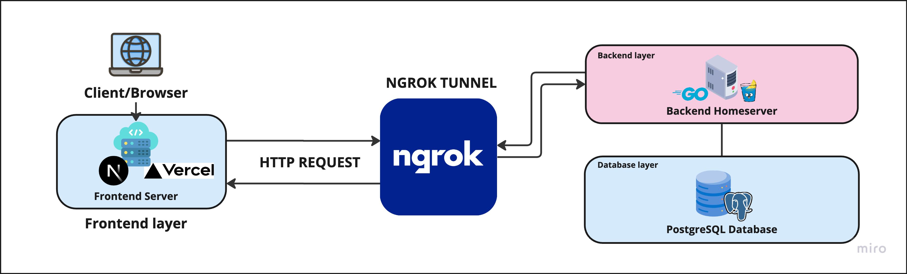

# 🏁 Tugas Akhir (TA) - Final Project

**Nama Mahasiswa**: Adrian Karuna Soetikno
**NRP**: 5025211019
**Judul TA**: RANCANG BANGUN SISTEM PENJUALAN UNTUK TOKO BAJU XYZ BERBASIS WEB MENGGUNAKAN NEXT.JS DAN GO
**Dosen Pembimbing**: Ir. Siti Rochimah MT.,Ph.D
**Dosen Ko-pembimbing**: Bintang Nuralamsyah, S.Kom, M.Kom

---

## 📺 Demo Aplikasi  
Embed video demo di bawah ini (ganti `VIDEO_ID` dengan ID video YouTube Anda):  

[](https://www.youtube.com/watch?v=y6tNBjZiYwE)  
<iframe width="560" height="315" src="https://www.youtube.com/embed/y6tNBjZiYwE?si=ibc2AxbLCiOXxHx1" title="YouTube video player" frameborder="0" allow="accelerometer; autoplay; clipboard-write; encrypted-media; gyroscope; picture-in-picture; web-share" referrerpolicy="strict-origin-when-cross-origin" allowfullscreen></iframe>
*Klik gambar di atas untuk menonton demo*

---
## 🛠 Panduan Instalasi & Menjalankan Software  

### Langkah-langkah  

### Frontend
1. **Clone Repository**  
   ```bash
   git clone https://github.com/Informatics-ITS/ta-Adrian0429.git
   ```
2. **Instalasi Dependensi**
   ```bash
   cd /frontend
   pnpm install  # Contoh untuk Node.js
   ```
3. **Konfigurasi**
- Buatlah sebuah file .env 
- lalu isikan file env tersebut dengan url backend (gunakan NEXT_PUBLIC_API_URL_DEV)
4. **Jalankan Aplikasi**
   ```bash
      pnpm dev
   ```
5. Buka browser dan kunjungi: `http://localhost:3000` (sesuaikan dengan port proyek Anda)

---

### Backend
1. **Clone Repository**  
   ```bash
   git clone https://github.com/Informatics-ITS/ta-Adrian0429.git
   ```
2. **Konfigurasi**
- masuk ke direktori /backend
- siapkan sebuah database postgresql dan siapkan extensi dalam database tersebut dengan 'CREATE EXTENSION IF NOT EXISTS "uuid-ossp" '
- salin env.example dan isi sesuai konfigurasi yang dimiliki
3. **Jalankan Aplikasi**
   ```bash
      go run main.go
   ```
4. Jalankan postman anda dan gunakan api dengan base url "http://127.0.0.1:8888"

---


## 📚 Dokumentasi Tambahan

### Dokumentasi API
- [![Dokumentasi API]](https://cloudy-sunset-897810.postman.co/workspace/Bumi-Subur~84825291-ddea-46a8-83e6-5c1767653e71/collection/27704433-7430aa69-c92d-40c5-b4ad-d681ed4a018a?action=share&creator=27704433&active-environment=27704433-eb93a651-1754-4b0f-90b2-4e22c0db78c9)

### Diagram Arsitektur 


---

## ⁉️ Pertanyaan?

Hubungi:
- Penulis: royankaruna@gmail.com
- Pembimbing Utama: 
